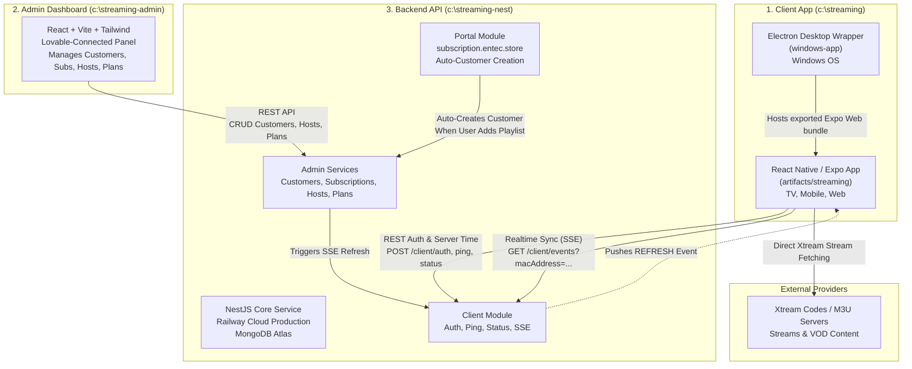

# 🌐 EN-TEC Streaming Ecosystem — Master Codex & AI Agent Guide
> **Comprehensive Architectural, Operational, and Technical Specification**  
> *Targeted for AI Coding Agents (Codex, Antigravity, Claude Code, Cursor) and Software Engineers.*

---

## 📌 1. Ecosystem Overview & Architecture

The **EN-TEC Streaming** ecosystem is composed of three tightly integrated workspaces that together deliver a complete IPTV and VOD streaming service across Smart TVs, Android, Windows Desktop, Mobile, and Web:



### Workspace Locations
| Component | Local Path | Repository | Technology Stack | Hosting / Deployment |
| :--- | :--- | :--- | :--- | :--- |
| **Streaming App** | `c:\streaming` | `bandarwardi/EN-TEC-Streming` | React Native (Expo SDK 52), Zustand, Expo Router | Android TV / Mobile APK, Windows Electron |
| **Admin Dashboard** | `c:\streaming-admin` | `bandarwardi/streamline-hub` | React 18, Vite, TailwindCSS, Radix/shadcn UI | Firebase / Lovable |
| **Backend API** | `c:\streaming-nest` | `bandarwardi/entec_streaming_nestjs` | NestJS 11, Mongoose 9, JWT, RxJS | Railway (`/api`) + MongoDB Atlas |

---

## ⚡ 2. The 3 Core Pillars & Workspaces

### 📱 A. Streaming App (`c:\streaming`)
- **Main App Directory**: `c:\streaming\artifacts\streaming`
- **Desktop Electron Directory**: `c:\streaming\windows-app`
- **Key Capabilities**:
  1. **Cross-Platform UI with TV Remote Focus Engine**: Built for Android TV, tvOS, Windows, Web, and Mobile.
  2. **Xtream Codes & M3U Parser**: Imports live channels, movies, series, categories, and catchup with local AsyncStorage / disk caching.
  3. **High-Performance Player**: Video player supporting aspect ratios, subtitles, multi-audio tracks, HLS, TS, and MP4.
  4. **Dynamic Server-Verified Trial & App Locking**: Prevents unauthorized access when trial expires.
  5. **Real-Time Live Reload via SSE**: When an admin activates or updates a playlist in the admin panel, the app automatically reloads content without requiring a restart.

### 🛡️ B. Admin Dashboard (`c:\streaming-admin`)
- **Directory**: `c:\streaming-admin`
- **Connected to**: [Lovable.dev](https://lovable.dev)
- **Key Capabilities**:
  1. **Customer Management (`/customers`)**: View MAC addresses, assigned device keys, connection status (ACTIVE, INACTIVE, BLOCKED), and subscription count.
  2. **Subscription Management**: Assign Xtream accounts (Host, Username, Password), set expiration dates (`appExpiry`), toggle app activation license (`appActive`).
  3. **Server / Host Management (`/hosts`)**: Pre-configured IPTV servers with URLs, names, and a special custom host picker option (`آخر: [الدومين]`).
  4. **Store Plans Management (`/plans`)**: Configure pricing, durations, and feature lists displayed inside the app's in-screen subscription store.

### ⚙️ C. Backend API (`c:\streaming-nest`)
- **Directory**: `c:\streaming-nest`
- **Production Server**: `https://entecstreamingnestjs-production.up.railway.app/api`
- **Database**: MongoDB Atlas (`entec-streaming` cluster)
- **Key Capabilities**:
  1. **Client Endpoints (`/client`)**: Device registration, server-authoritative trial validation, device heartbeat, and SSE broadcast.
  2. **Portal Endpoints (`/portal`)**: User login via MAC/Key at `https://subscription.entec.store`.
  3. **Auto-Customer Creation**: Automatically creates a customer record in MongoDB when a client adds a custom playlist through the portal.
  4. **Server-Clock Authority**: Calculates exact expiration times using server timestamps (`new Date()`), preventing local device clock spoofing.

---

## 🔒 3. Critical Business Workflows

### ⏳ Workflow 1: 7-Day Server-Authoritative Trial & App Lock
1. **Device Registration**:
   - On first launch, the app sends `POST /client/register-device` with `{ macAddress, deviceKey }`.
   - The backend creates a `Device` record in MongoDB and assigns:
     - `trialStartsAt: new Date()` (current server time)
     - `trialEndsAt: new Date(serverNow + 7 * 24 * 60 * 60 * 1000)` (exact 7 days).
2. **Server Time Synchronization (`serverTimeOffset`)**:
   - The server returns `serverTime` in ISO format on every response (`auth`, `ping`, `status`).
   - The app store computes `serverTimeOffset = Date.parse(serverTime) - Date.now()`.
   - Any client-side time checks use `getServerTime() = new Date(Date.now() + serverTimeOffset)`.
   - **Local Clock Tampering Immunity**: If a user rolls their computer/TV clock back to 2020, the server still evaluates against its authoritative clock, returning `isTrialActive: false`.
3. **App Lock Enforcement**:
   - The app evaluates: `isAppActive = hasActiveAdminLicense || isTrialActive`.
   - If `!isAppActive` (Trial expired AND no active admin license):
     - `isAppLocked = true`, `subscriptionExpired = true`.
     - `AuthGuard` in `_layout.tsx` blocks access to `/(tabs)`, `/playlists`, `/player` and forces the `/activation` screen.
     - In `activation.tsx`: Notice displays `"Trial expired: Your 7-day complimentary trial has ended."`
     - The **Demo** button is locked with a padlock icon and `"Trial Expired"`. Clicking it displays a dialog blocking entry and directing to the subscription store.
   - **Heartbeat Lock (`sendHeartbeatPing`)**: Runs every 60 seconds while the app is active. If the trial expires while the user is watching, the heartbeat detects it from the server and immediately locks the app.

---

### 🌐 Workflow 2: Web Portal Playlist & Admin Auto-Customer Creation
1. **End-User Portal Action**:
   - User navigates to `https://subscription.entec.store` and logs in with their MAC Address and Device Key.
   - User pastes an M3U playlist URL (e.g. `http://myprovider.com:8080/get.php?username=abc&password=123`).
2. **Backend Auto-Registration (`portal.service.ts`)**:
   - Checks if a `Customer` exists for this MAC address.
   - If not found, it automatically creates a new `Customer`:
     - `name`: Defaulted to the normalized MAC Address (e.g., `EB:EB:F6:F8:E1:E0`).
     - `status`: `ACTIVE`.
   - Saves the custom playlist into `Device.customPlaylists`.
3. **Custom Host Handling (`hosts.service.ts` & Admin Dashboard)**:
   - If the playlist domain is not registered in the system's `hosts` collection, the admin dashboard displays a custom host option:
     `آخر: [domain.com:port]`
   - This ensures admins can see custom provider domains used by customers without requiring manual database migration.

---

### 🔄 Workflow 3: Real-Time SSE Updates
1. The app connects to `GET /client/events?macAddress=[MAC]` via Server-Sent Events (`EventSource`).
2. When an admin modifies subscriptions in `c:\streaming-admin`:
   - Admin panel calls `POST /client/devices/:macAddress/refresh`.
   - Backend pushes `{ data: { type: 'REFRESH' } }` through the SSE connection.
3. The app catches the event, invalidates search caches, re-authenticates with `/client/auth`, syncs admin subscriptions, and updates live channels with zero app downtime.

---

## 🚨 4. Mandatory Developer Rules (NEVER VIOLATE)

### 🎮 Rule 1: TV Remote Accessibility (`c:\streaming`)
> **DO NOT** use standard `<Pressable>`, `<TouchableOpacity>`, or `<TouchableWithoutFeedback>` for interactive elements.  
> **ALWAYS** use `<TVFocusable>` located at `@/components/TVFocusable`.  
> - Integrates with Android TV, tvOS, and spatial D-Pad navigation engines.  
> - Handles focus indicators, scale animations, and remote key handling (`onPress`, `onFocus`, `onBlur`).  
> - For absolute overlays (e.g., modal dismissals), use `<TVFocusable disableBorder />` or set `focusable={false}` on standard `<View>` containers so D-pad focus is never trapped.

### ⛔ Rule 2: Lovable Git History Preservation (`c:\streaming-admin`)
> This repository is connected to [Lovable](https://lovable.dev).  
> - **NEVER** rewrite published git history (`git push --force`, `git rebase -i`, or `git commit --amend` on pushed commits).  
> - Doing so will corrupt the project history on Lovable's sync engine.  
> - Keep commits clean and forward-only.

### ⏱️ Rule 3: Server Clock Authority (`c:\streaming-nest`)
> **NEVER** trust client-provided timestamps (`clientTime`) for license validity or trial expiration decisions.  
> - Always compute `serverNow = new Date()` inside NestJS services.  
> - Compare `serverNow` against `device.trialEndsAt` and `subscription.appExpiry`.

---

## 🛠️ 5. Build, Export & Run Cheat Sheet

### A. Running the Backend (`c:\streaming-nest`)
```powershell
cd c:\streaming-nest
npm install
npm run start:dev        # Development server (port 3000)
npx tsc --noEmit         # Typecheck verification
git push                 # Automatically deploys to Railway Cloud Production
```

### B. Running the Admin Dashboard (`c:\streaming-admin`)
```powershell
cd c:\streaming-admin
npm install
npm run dev              # Vite dev server (runs on port 8080 or next available)
npm run build            # Production bundle build
```

### C. Building & Running the Desktop App (`c:\streaming`)
```powershell
# 1. Export Web Bundle from Expo
cd c:\streaming\artifacts\streaming
npx expo export -p web

# 2. Copy exported files into Electron app wrapper
Copy-Item -Recurse -Force C:\streaming\artifacts\streaming\dist\* C:\streaming\windows-app\app\

# 3. Launch Electron Desktop App
cd c:\streaming\windows-app
npm start
```

---

## 📂 6. File Index & Key Code Paths

### 1. App (`c:\streaming`)
- `artifacts/streaming/store/app-store.ts`: Master Zustand store (auth, server time, Xtream parser, caching, subscriptions).
- `artifacts/streaming/app/_layout.tsx`: Root layout with `AuthGuard` protecting routes against trial expiration.
- `artifacts/streaming/app/activation.tsx`: Activation screen displaying MAC/Key, store modal, and dynamic trial countdown.
- `artifacts/streaming/components/TVFocusable.tsx`: Core spatial navigation component for TV remote controls.
- `artifacts/streaming/app/(tabs)/live.tsx`: Live TV channels viewer with EPG, categories, and search.
- `artifacts/streaming/app/player.tsx`: Universal video player.
- `windows-app/main.js`: Electron main process with local caching proxy.

### 2. Admin (`c:\streaming-admin`)
- `src/routes/customers.tsx`: Customer list, status management, device inspection.
- `src/routes/hosts.tsx`: Host server registry with custom host support (`آخر: [الدومين]`).
- `src/routes/plans.tsx`: Subscription packages & pricing.

### 3. Backend (`c:\streaming-nest`)
- `src/schemas/device.schema.ts`: `Device` model with `trialStartsAt`, `trialEndsAt`, `customPlaylists`.
- `src/devices/devices.service.ts`: Device registration and trial calculation helper (`getTrialInfo`).
- `src/client/client.service.ts`: `auth`, `ping`, `status`, and SSE event stream.
- `src/portal/portal.service.ts`: Customer portal and auto-customer creation on playlist upload.
